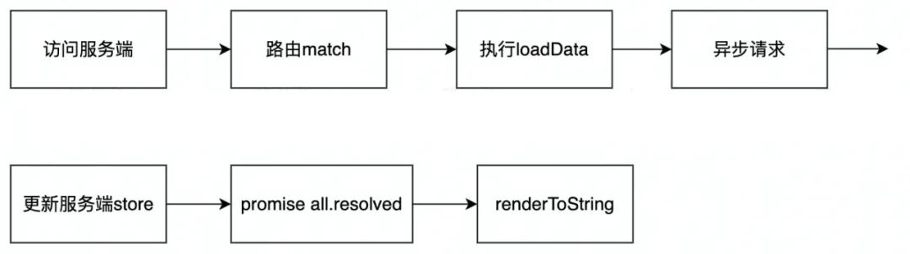

<TOCInline toc={props.toc} asDisclosure toHeading={3} />

## 2022/06/27

## 每周资讯 - 第`140`期

### 1. 这⼀次彻底弄懂：React 服务端渲染

#### 一、前言

在前端项目需要首屏渲染速度优化或 SEO 的场景下，大家或多或少都听过到过服务端渲染( SSR )，但大多数人对服务端渲染具体实现和底层原理还是比较陌生的。本文基于公司官网开发时做了服务端渲染改造基础上，系统理解和梳理这套体系的模式和逻辑，并写了一些笔记和[Demo](https://github.com/hellopanpan/my-ssr-react)便于深入理解。这次我们来以 React 为例，把服务端渲染彻底讲弄明白。本文主要有以下内容：

- 什么是服务端渲染，与客户端渲染的区别是什么？
- 为什么需要服务端渲染，服务端渲染的利弊是什么？
- 服务端渲染的原理是什么？
- 如何对 React 项目进行同构？
- react 服务端渲染的一些框架
- 服务端渲染一些新的 API

##### 1.1 什么是服务端渲染？

服务端渲染， SSR (Server-side Rendering) ，顾名思义，就是在浏览器发起页面请求后由服务端完成页面的 HTML 结构拼接，返回给浏览器解析后能直接构建出有内容的页面。

###### 用 node 实现一个简单的 SSR

我们使用 Koa 框架来创建 node 服务：

```js
//  demo1
var Koa = require('koa')
var app = new Koa()

// 对于任何请求，app将调用该函数处理请求：
app.use(async (ctx) => {
  // 将HTML字符串直接返回
  ctx.body = `
    <html>
      <head>
         <title>ssr</title>
        </head>
        <body>
        <div id="root">
            <h1>hello server</h1>
            <p>word</p>
        </div>
      </body> 
      </html>`
})
//监听
app.listen(3001, () => {
  console.log('listen on 3001 port!')
})
```

启动服务后访问页面，查看网页源代码是这样：


```bash
npx create-react-app my-app
```

上面的例子就是一个简单的服务端渲染，其服务侧直接输出了有内容的 HTML，浏览器解析之后就能渲染出页面。与服务端渲染对应的是客户端渲染 ，CSR（Client Side Rendering），通俗的讲就是由客户端完成页面的渲染。其大致渲染流程是这样：在浏览器请求页面时，服务端先返回一个无具体内容的 HTML，浏览器还需要再加载并执行 JS，动态地将内容和数据渲染到页面中，才能完成页面具体内容的显示。目前主流的 React ，Vue， Angular 等 SPA 页面未经特殊处理均采用客户端渲染。最常见脚手架 create-react-app 生成的项目就是客户端渲染：


上面采用客户端渲染的 HTML 页面中`<div id="root"></div>`中无内容，需在浏览器端加载并执行 bundle.js 后才能构建出有内容页面。

##### 1.2 为什么用服务端渲染？

###### 1.2.1 服务端渲染的优势

相比于客户端渲染，服务端渲染有什么优势？我们可以从下图对比一下这两种不同的渲染模式。


- 首屏时间更短

采用客户端渲染的页面，要进行 JS 文件拉取和 JS 代码执行，动态创建 DOM 结构，客户端逻辑越重，初始化需要执行的 JS 越多，首屏性能就越慢；客户端渲染前置的第三方类库/框架、polyfill 等都会在一定程度上拖慢首屏性能。Code splitting、lazy-load 等优化措施能够缓解一部分，但优化空间相对有限。相比而言，服务端渲染的页面直接拉取 HTMl 就能显示内容，更短的首屏时间创造更多的可能性。

- 利于 SEO

在别人使用搜索引擎搜索相关的内容时，你的网页排行能靠得更前，这样你的流量就有越高，这就是 SEO 的意义所在。那为什么服务端渲染更利于爬虫爬你的页面呢？因为对于很多搜索引擎爬虫（非 google）HTML 返回是什么内容就爬什么内容，而不会动态执行 JS 代码内容。对客户端渲染的页面来说，简直无能为力，因为返回的 HTML 是一个空壳。而服务端渲染返回的 HTML 是有内容的。

SSR 的出现，就是为了解决这些 CSR 的弊端。

###### 1.2.2 权衡使用服务端渲染

并不是所有的 WEB 应用都必须使用 SSR，这需要开发者来权衡，因为服务端渲染会带来以下问题：

- 代码复杂度增加

为了实现服务端渲染，应用代码中需要兼容服务端和客户端两种运行情况，部分代码只能在客户端运行，需要对其进行特殊处理，才能在服务器渲染应用程序中运行。

- 需要更多的服务器资源

由于服务器增加了渲染 HTML 的需求，使得原本只需要输出静态资源文件的 nodejs 服务，新增了数据获取的 IO 和渲染 HTML 的 CPU 占用，如果流量突然暴增，有可能导致服务器宕机，因此需要使用响应的缓存策略和准备相应的服务器负载。

- 涉及构建设置和部署的更多要求

与可以部署在任何静态文件服务器上的完全静态单页面应用程序 (SPA) 不同，服务器渲染应用程序，需要处于 Node.js server 运行环境。


因此，在使用服务端渲染 SSR 之前，需要考虑投入产出比：是否真的需要 SEO，是否需要将首屏时间提升到极致。如果都没有，使用 SSR 反而小题大做了。

##### 1.3 服务端渲染的发展史

其实服务端渲染并不是什么新奇的概念，前后端分层之前很长的一段时间里都是以服务端渲染为主（JSP、PHP），那时后端一把梭哈，在服务端生成完整的 HTML 页面。但那时的服务端渲染和现在还是有本质的区别，存在比较多的弊端，每一个请求都要动态生成 HTML，存在大量的重复，服务器机器成本也相对比较高，前后端代码完全掺杂在一起，开发维护难。

随着业务不断发展变化，后端要写的 JS 逻辑也越发复杂，而且 JS 有很多潜在的坑使后端越发觉得这是块烫手山芋，于是逐渐出现了前后端分层。伴随 AJAX 的兴起，浏览器可以做到了不再重现请求页面就可更新局部视图。还可以利用客户端免费的计算资源，后端侧逐渐演变成了提供数据支持。jquery 的兴起，良好的客户端兼容性使 JS 不再受困于各种版本浏览器兼容问题，一统了前端天下。

此后伴随 node 的兴起，前后端分离越演越烈。前端能摆脱后端的依赖单独起服务，三大框架 vue，react，angular 也迅势崛起，以操作数据就能更新视图，前端开发人员逐渐摆脱了与烦人的 Dom 操作打交道，能够专心的关注业务和数据逻辑。前端同时探索出了功能插件，UI 库，组件等多种代码复用方案，形成了繁荣的前端生态。

但是三大框架采用客户端渲染模式，随着代码逻辑的加重，首屏时间成了一个很大的问题，同时开发人员也发现 SEO 也出了问题，大多搜索引擎根本不会去执行 JS 代码。但是也不可能再回头走老路，于是前端又探索出了一套服务端渲染的框架来解决掉这些问题。此时的服务端渲染是建立在成熟的组组件，模块生态之上，基于 Node.js 的同构方案成为最佳实践。

#### 2、React 服务端渲染的原理

##### 2.1 基本思路

###### React 服务端渲染流程

React 服务端渲染的基本思路，简单理解就是将组件或页面通过服务器生成 html 字符串，再发送到浏览器，最后将静态标记"混合"为客户端上完全交互的应用程序。因为要考虑 React 在服务端的运行情况，故相比之前讲的多了在浏览器端绑定状态与事件的过程。

我们可以结合下面的流程图来一览完整的 React 服务端渲染的全貌：当浏览器去请求一个页面，前端服务器端接收到请求并执行 React 组件代码，此时 React 代码中可能包含向后端服务器发起请求，待请求完成返回的数据后，前端服务器组装好有内容的 HTML 里返给浏览器，浏览器解析 HTML 后已具备展示内容，但页面并不具备交互能力。


下一阶段，在返回的 HTMl 中还有 script 链接，浏览器再拉取 JS 并执行其包含的 React 代码，其能在浏览器端执行完整的生命周期，并通过相关 API 实现复用此前返回 HTML 节点并添加事件的绑定，此时页面才就具备完全交互能力。总的来说，react 服务端渲染包含有两个过程：服务端渲染 + 客户端 hydrate 渲染。服务端渲染在服务端渲染出了首屏内容；客户端 hydrate 渲染复用服务端返回的节点，进行一次类似于 render 的 hydrate 渲染过程，把交互事件绑上去（此时页面可交互），并接管页面。

服务端处理后返回的

客户端“浸泡”还原后的


###### 核心思想（同构）

从上面的流程中可以看到，客户端和服务端都要执行 React 代码完成渲染，那是不是就要写两份代码，供双端使用? 当然不需要，也完全不合理。所谓同构，就是让一份 React 代码，既可以在服务端中执行，也可以在客户端中执行。


###### SSR 技术栈

我们这里简单理了一下服务端渲染涉及到的技术栈：

知道了服务端渲染、同构的大概思路之后，下面从头开始，一步一步完成具体实践，深入理解其原理。


##### 2.2 服务端如何渲染 React 组件？

按照之前流程的大概思路，我们首先需要将 React 组件在服务端转换成 HTML 字符串，那怎么做呢？React 提供的面向服务端的 API（react-dom/server），提供了相关方法能够将 React 组件渲染成静态的（HTML）标签。下面我们简单了解下 react-dom/server。

###### react-dom/server

react-dom/server 有 renderToString、renderToStaticMarkup，renderToNodeStream、renderToStaticNodeStream 四个方法能够将 React 组件渲染成静态的（HTML）标签，前两者能在客户端和服务端运行，后两者只能在服务端运行。

renderToStaticMarkup VS renderToString：renderToString 方法会在 React 内部创建的额外 DOM 属性，例如 data-reactroot， 在相邻文本节点之间生成`<!-- -->`，这些属性是客户端执行 hydrate 复用节点的关键所在，data-reactroot 属性是服务端渲染的标志之一。如果你希望把 React 当作静态页面生成器来使用，renderToStaticMarkup 方法会非常有用，因为去除额外的属性可以节省一些字节。

```jsx
// Home.jsx
import React from 'react'

const Home = () => {
  return (
    <div>
      <h2 onClick={() => console.log('hello')}>This is Home Page</h2>
      <p>Home is the page ..... more discribe</p>
    </div>
  )
}
export default Home
```

我们使用 React-dom/server 下提供的 renderToString 方法，在服务端将其转换为 html 字符串：

```jsx
//  server.js
import Koa from 'koa'
import React from 'react'
import { renderToString } from 'react-dom/server'
import Home from './containers/Home'

const app = new Koa()
app.use(async (ctx) => {
  // 核心api renderToString 将react组件转化成html字符串
  const content = renderToString(<Home />)
  ctx.body = `
    <html>
      <head>
        <title>ssr</title>
      </head>
      <body>
        <div id="root">${content}</div>
      </body>
    </html>
   `
})

app.listen(3002, () => {
  console.log('listen:3002')
})
```

可以看到上面代码里有 ES6 的 import 和 jsx 语法，不能直接运行在 node 环境，需要借助 webpack 打包， 构建目标是 commonjs。新建 webpack.server.js 具体配置如下：

```js
// webpack.server.js
const path = require('path')
const nodeExternals = require('webpack-node-externals')
module.exports = {
  mode: 'development',
  target: 'node',
  entry: './server.js',
  resolve: {
    extensions: ['.jsx', '.js', '.tsx', '.ts'],
  },
  module: {
    rules: [
      {
        test: /\.jsx?$/,
        loader: 'babel-loader',
        exclude: /node_modules/,
        options: {
          presets: ['@babel/preset-react', '@babel/preset-env'],
          plugins: [
            [
              '@babel/plugin-transform-runtime',
              {
                absoluteRuntime: false,
                corejs: false,
                helpers: true,
                regenerator: true,
                version: '7.0.0-beta.0',
              },
            ],
          ],
        },
      },
    ],
  },
  output: {
    filename: 'bundle.js',
    path: path.resolve(__dirname, 'build'),
  },
  externals: [nodeExternals()],
}
```

在 webpack 构建完成后，可在 Node 环境运行 build/bundle.js，访问页面后查看网页源代码，可以看到，React 组件中的内容已经完整地包含在服务端返回到 html 里面。我们成功迈出了服务端渲染第一步。此时，我们也有必要再深入了解 renderToString 到底做了什么，提前踩坑！


###### renderToString

除了将 React 组件转换成 html 字符串外，renderToString 还有做了下面这些：

1. 会执行传入的 React 组件的代码，但是其只执行到 React 生命周期初始化过程的 render 及之前，即下面红框的部分，其余大部分生命周期函数在服务端都不执行；这也是服务端渲染的坑点之一。


2. renderToString 生成的产物中会包含一些额外生成特殊标记，代码体积会有所增大，其中属性 data-reactroot 是服务端渲染的标志，便于后续客户端通过 hydrate 复用 HTML 节点。在 React16 前后其产物也有差距：在 React 16 之前，服务端渲染采用的是基于字符串校验和（string checksum）的 HTML 节点复用方式， 会额外生成生成 data-reactid、data-react-checksum 等属性；React 16 改用单节点校验来复用（服务端返回的）HTML 节点，不再生成 data-reactid、data-react-checksum 等体积占用大户，只在空白节点间多了`<!-- -->` 这样的标记。

```jsx
// renderToString react16前
<div data-reactroot="" data-reactid="1" data-react-checksum="122239856">
  <span data-reactid="2">Welcome to React SSR!</span>
  <!-- react-text: 3 --> Hello There! <!-- /react-text -->
</div>

// renderToString react16
<div data-reactroot=""><h1 class="here"><span>Welcome to React SSR!</span><!-- --> Hello There!</h1></div>
```

3. 会被故意忽略掉的 on 开头的的属性，也就忽略掉了 react 代码中事件处理，这是也是坑点之一。服务端返回的 html 里没有处理事件点击，需要靠后续客户端 js 执行绑定事件。

```js
function shouldIgnoreAttribute(
  name: string,
  propertyInfo: PropertyInfo | null,
  isCustomComponentTag: boolean
): boolean {
  if (propertyInfo !== null) {
    return propertyInfo.type === RESERVED
  }
  if (isCustomComponentTag) {
    return false
  }
  if (
    name.length > 2 &&
    (name[0] === 'o' || name[0] === 'O') &&
    (name[1] === 'n' || name[1] === 'N')
  ) {
    return true
  }
  return false
}
```


上面的例子我们可以看到 React 的代码里有点击事件，但点击后没有反应。需要靠后续客户端 js 执行绑定事件。如何实现？这就需要同构了。

##### 2.3 实现基础的同构

前文已经大概讲了同构的概念，那为什么需要同构？之前的服务端代码在处理点击事件时故意忽略掉了这类属性，在服务端执行的生命周期也是不完整的，此时的页面是不具备交互能力的。同构，正是解决这些问题的关键，React 代码在服务器上执行一遍之后，浏览器再去加载 JS 后又运行了一遍 React 代码，完成事件绑定和完整生命周期的执行，从而才能成为完全可交互页面。


###### react-dom：hydrate

实现同构的另一个核心 API 是 React-dom 下的 hydrate，该方法能在客户端初次渲染的时候去复用服务端返回的原本已经存在的 DOM 节点，于渲染过程中为其附加交互行为（事件监听等），而不是重新创建 DOM 节点。需要注意是，服务端返回的 HTML 与客户端渲染结果不一致时，出于性能考虑，hydrate 可以弥补文本内容的差异，但并不能保证修补属性的差异，而是将错就错；只在 development 模式下对这些不一致的问题报 Warning，因此必须重视 SSR HydrationWarning，要当 Error 逐个解决。

那具体实现同构？


上面这里我们提供了一个基本的架构图，可以看到，服务端运行 React 生成 html 代码我们已经基本实现，目前需要做的就是生产出客户端执行的 index.js，那么这个 index.js 我们如何生产出来呢？

##### 具体实践

首先新建客户端代码 client.js，引入 React 组件，通过 ReactDom.hydrate 处理挂载到 Dom 节点， hydrate 是实现复用的关键。

```jsx
// client.js
import React from 'react'
import ReactDom from 'react-dom'
import Home from './containers/Home'

const App = () => {
  return <Home></Home>
}

ReactDom.hydrate(<App />, document.getElementById('root'))
```

客户端代码也需要 webpack 打包处理，新建 webpack.client.js 具体配置如下，需要注意打包输出在 public 目录下，后续的静态资源服务也起在了这个目录下。

```js
// webpack.client.js
const path = require('path')
const resolve = (dir) => path.resolve(__dirname, './src', dir)
module.exports = {
  mode: 'development',
  entry: './client.js',
  output: {
    filename: 'index.js',
    path: path.resolve(__dirname, 'public'),
  },
  module: {
    rules: [
      // babel-loader处理js的一些配置
    ],
  },
}
```

服务端的静态资源服务使用 koaStatic 起在 public 目录，这样就能通过外链访问到打包出来的客户端 js，同时我们在 html 中嵌入这个链接。

```js
// server.js
import koaStatic from 'koa-static'

const app = new Koa()
app.use(koaStatic('public'))

app.use(async (ctx) => {
  const content = renderToString(<Home />)
  console.log(content)
  ctx.body = `
    <html>
      <body>
        <div id="root">${content}</div>
            <script src="./index.js"></script>
      </body>
    </html>
   `
})
app.listen(3003, () => {
  console.log('listen:3003')
})
```

简单看下此时的代码结构是这样：

```
├── package.json
├── webpack.client.js
├── webpack.server.js
├── server.js
├── client.js
└── containers
    └── Home.jsx
```

通过上面一番操作，简单的同构基本可以跑起来了，点击对应位置后看到有了反应，查看网页源代码如下。可以看到多了 script 标签的 index.js 这段，这是在客户端执行的 js 代码。


以上我们仅仅是就完成了一个 React 基础的同构，但这还远不够，一个完整的前端页面还包含路由，状态管理，请求服务端数据等，这些也需要进行同构，且看下面为你一一道来。

##### 2.4 路由的同构

我们之前页面只是一个页面， 但实际开发的应用用一般都是多个页面的，这就需要加入路由了。服务端渲染加入路由就涉及到同一份路由在不同端的执行，这就是路由的同构。

下面一步步来：首先加入 About 页面，并书写路由配置 routes.js

```js
// routes.js
import Home from './containers/home'
import About from './containers/about'
export default [
  { path: '/', component: Home, exact: true },
  {
    path: '/about',
    component: About,
    exact: true,
  },
]
```

在客户端侧加入路由的写法还是熟悉的写法，考虑到页面中可能涉及多级路由的渲染，这里直接引入 react-router-config 中来处理：

```jsx
// client.js
import { BrowserRouter } from 'react-router-dom'
import { renderRoutes } from 'react-router-config'
import Routes from './routes'

const App = () => {
  return (
    <BrowserRouter>
      <div>{renderRoutes(Routes)}</div>
    </BrowserRouter>
  )
}
```

react-router 为服务端提供了 StaticRouter，需显式地向 location 传 path。

```js
// server.js
import { StaticRouter } from "react-router-dom";
import { renderToString } from "react-dom/server";
import Routes from "./routes";
import { renderRoutes } from "react-router-config";

const app = new Koa();
app.use(koaStatic("public"));

app.use(async (ctx) => {
  const content = renderToString(
    <StaticRouter location={ctx.request.path}>
      <div>{renderRoutes(Routes)}</div>
    </StaticRouter>
  )；
}
```

以上就完成了路由的配置，还比较简单吧，此时页面的路由跳转基本没问题了。

##### 2.5 Redux 的同构

如何让前端页面的应用状态可控、让协作开发高效也是我们必须考虑的问题。Redux 作为 React 最常见的状态管理方案被很多项目引入来解决这一问题。那引入 Redux 如何被到同构项目中？这里，我们还是简单回顾一下 redux 运作流程，不熟悉的可以移步 redux 熟悉下。接下来开启 Redux 的同构之旅。


##### 第一步：创建全局 STORE

首先我们创建了一个 store.js，初始化配置并导出一个函数用来实例化 store，以提供给客户端和服务端同时使用。为什么 store 要导出一个函数？因为这段代码后面服务端使用时，如果下面的 store 导出的是一个单例，所有的用户用的是同一份 store，那将是灾难性的结果。

```jsx
// store.js
import { createStore, applyMiddleware, combineReducers } from 'redux'
import thunk from 'redux-thunk'
// 这里提前引入了About组件下的store
import { reducer as AboutReducer } from '../containers/store'

const reducer = combineReducers({
  about: AboutReducer,
})

// 导出成函数的原因
export default () => {
  return createStore(reducer, applyMiddleware(thunk))
}
```

##### 第二步：连接全局 STORE

客户端的写法还是熟悉的样子：

```jsx
//client.js
import { Provider } from 'react-redux'
import getStore from './store'

const App = () => {
  return (
    <Provider store={getStore()}>
      <BrowserRouter>
        <div>{renderRoutes(Routes)}</div>
      </BrowserRouter>
    </Provider>
  )
}
```

服务端 server.js 的写法也是类似：

```jsx
// server.js
import { Provider } from "react-redux";
import getStore from "./store";

const app = new Koa();
app.use(koaStatic("public"));

app.use(async (ctx) => {
  const content = renderToString(
    <Provider store={getStore()}>
      <StaticRouter location={ctx.request.path}>
        <div>{renderRoutes(Routes)}</div>
      </StaticRouter>
    </Provider>
  );
}
```

##### 第三步：组件的 store

新建 About 组件使用的 store，其 action 和 reducer 的写法如下，注意此时我们在 action 里发起了一个异步请求。

```jsx
// containers/store/reduccer.js
import { CHANGE_LIST } from './constants'

const defaultState = { name: 'panpan', age: 18, list: [] }
export default (state = defaultState, action) => {
  switch (action.type) {
    case CHANGE_LIST:
      return { ...state, list: action.payload }
    default:
      return state
  }
}
```

```jsx
// containers/store/action.js
import axios from 'axios'
import { CHANGE_LIST } from './constants'

const changeAction = (payload) => ({
  type: CHANGE_LIST,
  payload,
})

const getHomeList = () => {
  return (dispatch) => {
    return axios.get('http://localhost:3008/mock/1').then((res) => {
      dispatch(changeAction(res.data.data || []))
    })
  }
}

export default {
  getHomeList,
}
```

About 组件连接 Redux:

```jsx
// containers/About.js
import { connect } from 'react-redux'
import { action } from './store'

const About = () => {
  useEffect(() => {
    props.getList()
  }, [])
  // ...
}
const mapStateToProps = (state) => ({
  name: state.about.name,
  age: state.about.age,
  list: state.about.list,
})
const mapDispatchToProps = (dispatch) => ({
  getList() {
    dispatch(action.getHomeList())
  },
})

export default connect(mapStateToProps, mapDispatchToProps)(About)
```

经过一番改造后，项目变成了这样：

```
├── package.json
├── mock.server.js
├── webpack.client.js
├── webpack.server.js
├── routes.js
├── server.js
├── client.js
└── store
|    └── index.js
└── containers
    ├── Home.js
    ├── About.js
    └── store
        ├── index.js
        ├── action.js
        ├── reducer.js
        └── constants.js
```

通过上述操作 Redux 基本可以跑起来了，可以发现写法跟熟悉的客户端渲染大体差不多，只多了引入 server 端的步骤。但是目前的 redux 还存在一定的问题，我们一起再来看。

##### 服务端没数据问题

上面的 redux 在同构项目中跑起来咋一看是没什么问题，但当我们把 js 禁用或直接查看源代码时，就会发现 About 组件内并不存在异步请求的数据列表，换句话说服务器端的 store 的 list 始终是空的，服务端并没有发起相应的数据请求。为什么会这样呢？

分析一下：当浏览器发起页面请求后，服务器接收到请求，此时服务器和客户端的 store 的 list 都为空， 接着服务端开始渲染执行 React 代码，根据此前讲 rendertostring 坑之一，服务端调用 React 代码时里面的生命周期的只到初始化时的 render 及之前，而 About 组件内发起的异步请求是在 useEffect 内，相当于是在 ComponentDidMount 阶段发起请求，所以服务器端渲染时根本不会执行里面的异步请求，因此服务器端的 store 的 list 始终是空的，所以我们看不到列表数据。之后客户端拉取了 JS 并执行 React 代码，React 在客户端能够执行完整的生命周期，故可以执行 useEffect 里的函数获取到数据并渲染到页面。换而言之，目前获取异步数据只是进行了后期的客户端渲染阶段。

如何让服务端将获得数据的操作执行一遍，以达到真正的服务端渲染的效果？这就是接下来要讲的服务端渲染异步数据。

##### 2.6 服务端渲染异步数据

上文的同构项目中跑起来后，我们是在组件的 useEffect 中发起的异步请求，服务端并不能执行到这一块。那能不能在其他生命周期获取异步请求数据？答案是不推荐，因为 React16 采用了 Fiber 架构后，render 之前的生命周期都可能被中断而执行多次，类似 getDerivedStateFromProps(静态方法), ComponentWillMount（废弃）, UNSAFE_componentWillMount 的生命周期钩子都有可能执行多次，所以不建议在这些生命周期中做有请求数据之类副作用的操作。而 componentDidMount 在 render 之后是确定被执行一次的，所以 React 开发中建议在 componentDidMount 生命周期函数进行异步数据的获取。那有没有其他的解决方案呢? React Router 恰好也考虑到了这点，提供了这样一种解决方案，需要我们对路由进行一些改造。

###### React Router 解决方案

React Router 解决方案的基本思路：


首先，改造原有的路由，配置了一个 loadData 参数，这个参数代表要在服务端获取数据的函数：

```jsx
// router.js
import Home from './containers/home'
import About from './containers/about'
export default [
  { path: '/', component: Home, exact: true },
  {
    path: '/about',
    component: About,
    exact: true,
    loadData: About.loadData,
  },
]
```

在服务端匹配路径对应的路由，如果这个路由对应的组件有 loadData 方法，那么就执行一次,并将 store 传进 loadData 里面去，注意 loadData 函数调用后需要返回 Promise 对象，等待 Promise.all 都 resolve 后，此时传过去的 store 已经完成了更新，便可以在 renderToString 时放心使用：

```jsx
// server.js
import { renderRoutes, matchRoutes } from "react-router-config";
import { Provider } from "react-redux";
import getStore from "./store";

app.use(async (ctx) => {
  const store = getStore();
  // 匹配到路径对应的路由
  const matchArr = matchRoutes(Routes, ctx.request.path);
  let promiseArr = [];
  matchArr.forEach((item) => {
    // 判断有没有 loadData
    if (item.route.loadData) {
      // 要将store传递过去
      // item.route.loadData() 返回的是一个promise
      promiseArr.push(item.route.loadData(store));
    }
  });
  // 等待异步完成，store已完成更新
  await Promise.all(promiseArr);
  const content = renderToString(
    <Provider store={store}>
      <StaticRouter location={ctx.request.path}>
        <div>{renderRoutes(Routes)}</div>
      </StaticRouter>
    </Provider>
  );
}
```

接下来是组件内 loadData 函数，发起异步请求，并返回一个 Promise

```jsx
// containers/About.js
import { connect } from 'react-redux'
import { action } from './store'

const About = (props) => {
  useEffect(() => {
    props.getList()
  }, [])
  // ...
}
About.loadData = (store) => {
  //可能存在多个数据请求，所以用promise.all包一层
  return Promise.all([store.dispatch(action.getHomeList())])
}
const mapStateToProps = (state) => ({
  name: state.about.name,
  age: state.about.age,
  list: state.about.list,
})
const mapDispatchToProps = (dispatch) => ({
  getList() {
    dispatch(action.getHomeList())
  },
})

export default connect(mapStateToProps, mapDispatchToProps)(About)
```

通过以上改造，服务端可以获取到异步数据了。但是眼尖的朋友可能注意到，页面此时还存在问题，页面中还不时存在 list 闪烁问题，这是什么原因导致的呢？这就涉及到数据的同步问题。

##### 数据的注水和脱水

让我们来分析一下客户端和服务端的运行流程：

可以看到客户端和服务端的 store 都经历了初始化置空的问题，导致 store 不同步, 那如何才能让这两个 store 的数据同步变化呢? 这就涉及到数据的注水和脱水。“注水”：在服务端获取获取之后，在返回的 html 代码中加入这样一个 script 标签，这样就将服务端 store 数据注入到了客户端全局的 window.context 对象中。

```jsx
// server.js
app.use(async (ctx) => {
  // ...
  ctx.body = `
    <html>
      <head>
        <title>ssr</title>
        
      </head>
      <body>
        <div id="root">${content}</div>
        <script>
         window.context = {
          state: ${JSON.stringify(store.getState())}
        }
        </script>
        <script src="./index.js"></script>
      </body>
    </html>
   `
})
```

“脱水”处理：把 window 上绑定的数据给到客户端的 store，因此在 store.js 区分了客户端和服务端不同的导出函数。

```jsx
// store.js
// 客户端使用
export const getClientStore = () => {
  const defaultState = window.context ? window.context.state : {}
  return createStore(reducer, defaultState, applyMiddleware(thunk))
}
// 服务端使用
export const getServerSore = () => {
  return createStore(reducer, applyMiddleware(thunk))
}
```

至此 redux 包含异步数据的获取的同构就完成了。

##### 2.7 css 的服务端渲染

为什么需要做 css 要服务端渲染？主要是解决页面的 FOUC 闪屏问题。页面如果没做 css 的服务服务端渲染，我们一开始拉取到的 HTML 页面是没有样式的，页面的样式正常显示主要依赖于后面的客户端渲染，我们知道客户端渲染的时间相对要长很多，如果渲染前后存在较大的样式差距，就会引起闪屏。

还是以 About 组件为例，页面中加入样式：

```css
.title {
  color: aqua;
  background: #999;
  height: 100px;
  line-height: 100px;
  font-size: 40px;
}
```

```jsx
// containers/About.js
import styles from './about.css'

const About = (props) => {
  // ...
  return <h3 className={styles.title}>List Content</h3>
}
```

需要 webpack 中相应的配置处理 css，我们先处理客户端打包

```js
{
    test: /\.css?$/,
    use: [
      "style-loader",
      {
        loader: "css-loader",
        options: {
          modules: true,
        },
      },
    ],
 }
```

上面的代码跑起来，就会发现有明显的闪烁，复盘一下：页面一开始 html 是没样式的，待到客户端 js 执行完成后，页面才突然有了样式显示正常。为了避免这种闪烁带来的不愉快体验，服务端也需要进行 css 的渲染。

##### 在服务端如何处理 css？

客户端 webpack 采用 css-loader 处理后，style-loader 直接将样式通过 DOM 操作进行插入，这对于浏览器环境很好很方便，但是对于服务端的 Node 环境，这就没法愉快的玩耍了。Node 环境下可将样式插入到生成的 html 字符串中，而不是进行 DOM 操作。这时就需要用到另外一个跨平台的 loader：isomorphic-style-loader，在服务端的 webpack 配置是这样：

```js
// webpack.server.js
{
    test: /\.css?$/,
    use: [
      "isomorphic-style-loader",
      {
        loader: "css-loader",
        options: {
          modules: true,
        },
      },
    ],
  },

```

通过 isomorphic-style-loader 处理，我们可以在组件内直接通过 styles.\_getCss 即可拿到 CSS 代码，但这还不够，如何将拿到的 css 传回到服务端 sever.js 里从而塞入返回体呢？

```jsx
// containers/About.js
import styles from './about.css'

const About = (props) => {
  console.log(styles._getCss && styles._getCss())
  // ...
}
```


```jsx
// server.js
app.use(async (ctx) => {
  // 初始化 context
  let context = { css: [] }
  const content = renderToString(
    <Provider store={store}>
      // StaticRouter 传入context，组件接收到的props为staticContext
      <StaticRouter location={ctx.request.path} context={context}>
        <div>{renderRoutes(Routes)}</div>
      </StaticRouter>
    </Provider>
  )
  // 将css插入到head里面
  ctx.body = `
    <html>
      <head>
        <title>ssr</title>
        <style>${context.css.join('\n')}</style>
      </head>
      ...
    </html>
   `
})
```

```js
// containers/About.js
import styles from './about.css'

const About = (props) => {
  // 只有服务端才传过来了context，组件中props为staticContext
  if (props.staticContext) {
    // 将css推入数组，改变了传入的context
    props.staticContext.css.push(styles._getCss())
  }
  // ...
}
```

通过上面的操作，css 的服务端渲染基本能正常工作。需要注意的是 React-router 传过来的 context 只有配置对象 routes 中的组件才能拿到，如果组件里面再嵌入子组件，需要把 staticContext 透传过去，才能对子组件 props.staticContext 进行相应操作。当然这里更推荐官方 demo 里的另一种写法，且看下面。

##### 更推荐写法

我们可以查看 isomorphic-style-loader 的 demo，更推荐写法是：客户端、服务端都用 isomorphic-style-loader，webpack 处理客户端 css 是这样配置的：

```jsx
//  webpack.client.js
{
    test: /\.css?$/,
    use: [
      "isomorphic-style-loader",
      {
        loader: "css-loader",
        options: {
          modules: true,
        },
      },
    ],
},
```

组件内的写法也有相应改变，isomorphic-style-loader 提供了 hooks：useStyles

```jsx
// containers/About.js
import useStyles from 'isomorphic-style-loader/useStyles'
import styles from './about.css'

const About = (props) => {
  useStyles(styles)
  // ...
}
```

在服务端的代码里是这样的：

```jsx
// server.js
import StyleContext from 'isomorphic-style-loader/StyleContext'
// ...

app.use(async (ctx) => {
  const css = new Set()
  const insertCss = (...styles) => styles.forEach((style) => css.add(style._getCss()))
  const content = renderToString(
    <Provider store={store}>
      <StyleContext.Provider value={{ insertCss }}>
        <StaticRouter location={ctx.request.path} context={context}>
          <div>{renderRoutes(Routes)}</div>
        </StaticRouter>
      </StyleContext.Provider>
    </Provider>
  )
  ctx.body = `
    <html>
      <head>
        <title>ssr</title>
        <style>${[...css].join('')}</style>
      </head>
      <body>
        <div id="root">${content}</div>
        <script>
         window.context = {
          state: ${JSON.stringify(store.getState())}
        }
        </script>
        <script src="./index.js"></script>
      </body>
    </html>
  `
})
```

类似的，客户端也需要做下面的调整：

```js
// client.js
import StyleContext from 'isomorphic-style-loader/StyleContext'
// ...

const App = () => {
  const insertCss = (...styles) => {
    const removeCss = styles.map((style) => style._insertCss())
    return () => removeCss.forEach((dispose) => dispose())
  }
  return (
    <Provider store={getStore()}>
      <StyleContext.Provider value={{ insertCss }}>
        <BrowserRouter>
          <div>{renderRoutes(Routes)}</div>
        </BrowserRouter>
      </StyleContext.Provider>
    </Provider>
  )
}
```

##### 2.8 优化 title 和 description

页面中的 title，keywords 和 description 在 SEO 中具有举足轻重的地位。上面的 React 项目中初始只有一份 title 和 description，虽然不同页面可使用 js 生成的动态 title 和 descroption，但这类信息搜索引擎是没办法抓取到的。为了更好的 SEO，我们需要根据不同的页面组件显示来对应不同的网站标题和描述，这如何实现的呢？我们可以引入 react-helmet 来解决这个问题。

###### 引入 react-helmet

组件内：

```jsx
// containers/About.js
 import { Helmet } from "react-helmet";
 // ...
 return (
    <div>
      <Helmet>
        <meta charSet="utf-8" />
        <title>SSR About Page</title>
        <meta name="description" content="this is panpan about page" />
      </Helmet>
      <div>
  )
  // ..
```

服务端 html 部分：

```jsx
// server.js
const html = `
    <!doctype html>
    <html >
        <head>
            ${helmet.title.toString()}
            ${helmet.meta.toString()}
        </head>
    </html>
`
```

#### 三、开箱即用的 SSR 框架

##### Next.js

Next.js 是一款面向生产使用的 React 框架，提供了好些开箱即用的特性，支持静态渲染/服务端渲染混用、支持 TypeScript、支持打包优化、支持按路由预加载等等：其中，完善的静态渲染/服务端渲染支持让 Next.js 在 React 生态中独树一帜。


Next.js 中的预渲染（Pre-rendering），具体的分为两种方式：

- SSG（Static Site Generation）：也叫 Static Generation，在编译时生成静态 HTML
- SSR（Server-Side Rendering）：也叫 Server Rendering，用户请求到来时动态生成 HTML

与 SSR 相比，Next.js 更推崇的是 SSG，因为其性能优势更大（静态内容可托管至 CDN，性能提升立竿见影）。因此建议优先考虑 SSG，只在 SSG 无法满足的情况下（比如一些无法在编译时静态生成的个性化内容）才考虑 SSR、CSR。

##### UmiJS

Umi 很多功能是参考 next.js 做的，要说有哪些地方不如 Umi，可能是不够贴近业务，不够接地气。Umi 3 结合自身业务场景，在 SSR 上做了大量优化及开发体验的提升，内置 SSR，一键开启，开发调试方便。Umi 不耦合服务端框架，无论是哪种框架或者 Serverless 模式，都可以非常简单进行集成。


##### icejs

icejs 是淘系前端飞冰团队开发的一个基于 React 的渐进式框架。支持服务端渲染（即 SSR）能力，开发者可以按需一键开启 SSR 的模式。


#### 4、一些新的 API

##### 新 Hook：useId

服务端、客户端无法简单生成稳定、唯一的 id 是个由来已久的问题，早在多年前就有人提过 issue。直到最近 React conf 2021 上再次提出这个问题，推出了官方 Hook——useId，可在服务端、客户端生成唯一的 id，其背后的原理—— 每个 id 代表该组件在组件树中的层级结构，具体的就不展开了，有兴趣的可以去了解一下。

##### 服务端 suspense

React 18 带来了内置支持了 React.lazy 的 全新 SSR 架构, 性能优化的利器。这个架构能很大程度上提升用户体验：对比 React18 之前对整个应用 hydrate，现在可以做到对单个组件 hydrate，带来的一个好处，就是可以设置组件的渲染优先级。对比 code splitting 的优势在于如果同时设置了多个 suspense 组件，但是用户点击了之中某个组件，会优先 hydrate 那个被点击的组件。


#### 五、结语

以上就是本文关于 React 服务端渲染 ( SSR )的全部内容， 内容还是比较复杂的 。对于服务端渲染原理的学习可以帮助更好借鉴优秀的程序写法和激发对日常代码编程架构的思考，如果你更倾向箱即用的解决方案，那可以使用现有的 SSR 框架来搭建项目，这些框架的模版抽象和额外的功能扩展可以提供平滑的开箱体验。

#### 来源

- [这⼀次彻底弄懂：React 服务端渲染](https://mp.weixin.qq.com/s/j2rB8qE5OOPmLHAS7qdCrQ)

### 2. 如何让 x == 1 && x == 2 && x == 3 等式成立

#### 来源

- [如何让 x == 1 && x == 2 && x == 3 等式成立](https://mp.weixin.qq.com/s/05m6vw__X4P7gwgKcGlhzw)

## ts 挑战

### Concat

```ts
type Result = Concat<[1], [2]> // expected to be [1, 2]
```

### 上期答案

#### Push

```ts
type Push<T extends any[], U> = [...T, U]

type Result = Push<[1, 2], '3'> // [1, 2, '3']
```
