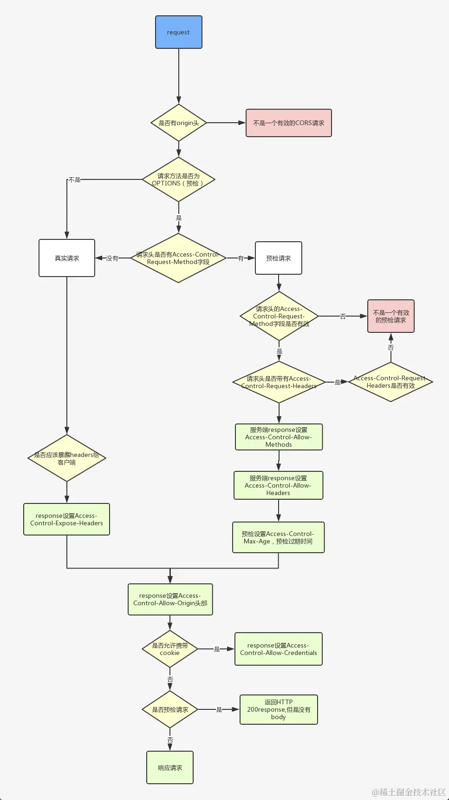

<TOCInline toc={props.toc} asDisclosure toHeading={2} />

# HTTP 笔记

## HTTP

传输的数据并不是计算机底层中的二进制包，而是完整的、有意义的数据，如 HTML 文件, 图片文件, 查询结果等超文本，能够被上层应用识别

在实际应用中，`HTTP`常被用于在`Web`浏览器和网站服务器之间传递信息，以明文方式发送内容，不提供任何方式的数据加密

### 特点

- 简单快速：每个资源（比如图片、页面）都通过 url 来定位。这都是固定的，在 http 协议中，处理起来也比较简单，想访问什么资源，直接输入 url 即可
- 灵活：http 协议的头部有一个数据类型，通过 http 协议，就可以完成不同数据类型的传输
- 无连接：连接一次，就会断开，不会继续保持连接。
- 无状态：客户端和服务器端是两种身份。第一次请求结束后，就断开了，第二次请求时，服务器端并没有记住之前的状态，也就是说，服务器端无法区分客户端是否为同一个人、同一个身份。有的时候，我们访问网站时，网站能记住我们的账号，这个是通过其他的手段（比如 session）做到的，并不是 http 协议能做到的。

### HTTP 报文的组成部分


### HTTP 方法

- GET：获取资源
- POST：传输资源
- put：更新资源
- DELETE：删除资源
- HEAD：获得报文首部

put 和 delete 在实际应用中用的很少。况且，业务中，一般不删除服务器端的资源。head 可能偶尔用的到。

### HTTP 状态码

- 1xx 表示消息
- 2xx 表示成功
- 3xx 表示重定向
- 4xx 表示请求错误
- 5xx 表示服务器错误

```text
100  Continue   继续，一般在发送post请求时，已发送了http header之后服务端将返回此信息，表示确认，之后发送具体参数信息
200  OK               正常返回信息
201  Created          请求成功并且服务器创建了新的资源
202  Accepted         服务器已接受请求，但尚未处理
204  No Content       请求处理成功, 但无内容响应
206 Partial Content   客户端发送了一个带range的get请求，服务器完成了他

301  Moved Permanently   请求的网页已永久移动到新位置。
302  Found               临时性重定向, GET请求时跟307相同，POST 请求一些旧客户端会转成 GET 请求。
303  See Other           查看其他位置, 临时性重定向，且总是使用 GET 请求新的 URI。
304  Not Modified        自从上次请求后，请求的网页未修改过。
307  Temporary Redirect  临时性重定向, 请求方法和消息主体不会变化

400  Bad Request   服务器无法理解请求的格式，客户端不应当尝试再次使用相同的内容发起请求。
401  Unauthorized  请求未授权。
403  Forbidden     禁止访问。
404  Not Found     找不到如何与 URI 相匹配的资源。

500  Internal Server Error   最常见的服务器端错误。
502  Bad Gateway             网关从上游服务器接收到的响应无效, 上游服务器挂了或者响应超时等原因引起
503  Service Unavailable     服务器端暂时无法处理请求（可能是过载或维护）。
```

- 100：客户端在发送 POST 数据给服务器前，征询服务器情况，看服务器是否处理 POST 的数据，如果不处理，客户端则不上传 POST 数据，如果处理，则 POST 上传数据。常用于 POST 大数据传输
- 206：一般用来做断点续传，或者是视频文件等大文件的加载, range 指的是请求的范围，客户端只请求某个大文件里的一部分内容。比如说，如果播放视频地址或音频地址的前面一部分，可以用到 206
- 301：永久重定向会缓存。新域名替换旧域名，旧的域名不再使用时，用户访问旧域名时用 301 就重定向到新的域名
- 302：临时重定向不会缓存，常用 于未登陆的用户访问用户中心重定向到登录页面
- 304：协商缓存，告诉客户端有缓存，直接使用缓存中的数据，返回页面的只有头部信息，是没有内容部分
- 400：参数有误，请求无法被服务器识别
- 403：告诉客户端进制访问该站点或者资源，如在外网环境下，然后访问只有内网 IP 才能访问的时候则返回
- 404：服务器找不到资源时，或者服务器拒绝请求又不想说明理由时
  p 503：服务器停机维护时，主动用 503 响应请求或 nginx 设置限速，超过限速，会返回 503
- 504：网关超时

## GET 和 POST

- GET: 方法请求一个指定资源的表示形式，使用 GET 的请求应该只被用于获取数据
- POST: POST 方法用于将实体提交到指定的资源，通常导致在服务器上的状态变化或副作用
- 本质上都是 TCP 链接，并无差别

### 区别

- GET 在浏览器回退时是无害的，而 POST 会再次提交请求。
- GET 产生的 URL 地址可以被 Bookmark，而 POST 不可以。
- GET 请求会被浏览器主动 cache，而 POST 不会，除非手动设置。
- GET 请求只能进行 url 编码，而 POST 支持多种编码方式。
- GET 请求参数会被完整保留在浏览器历史记录里，而 POST 中的参数不会被保留。做业务时要注意。为了防止 CSRF 攻击，很多公司把 get 统一改成了 post。
- GET 请求在 URL 中传送的参数是有长度限制的，而 POST 没有。get 请求在 url 中传递的参数有大小限制，基本是 2kb
- 对参数的数据类型，GET 只接受 ASCII 字符，而 POST 没有限制。
- GET 比 POST 更不安全，因为参数直接暴露在 URL 上，所以不能用来传递敏感信息。
- GET 参数通过 URL 传递，POST 放在 Request body 中

### 参数长度

HTTP 协议没有 Body 和 URL 的长度限制，对 URL 限制的大多是浏览器和服务器的原因

IE 对 URL 长度的限制是 2083 字节(2K+35)。对于其他浏览器，如 Netscape、FireFox 等，理论上没有长度限制，其限制取决于操作系统的支持

这里限制的是整个 URL 长度，而不仅仅是参数值的长度

服务器处理长 URL 要消耗比较多的资源，为了性能和安全考虑，会给 URL 长度加限制

### 安全

POST 比 GET 安全，因为数据在地址栏上不可见

然而，从传输的角度来说，他们都是不安全的，因为 HTTP 在网络上是明文传输的，只要在网络节点上捉包，就能完整地获取数据报文

只有使用 HTTPS 才能加密安全

### 数据包

对于 GET 方式的请求，浏览器会把 http header 和 data 一并发送出去，服务器响应 200（返回数据）

对于 POST，浏览器先发送 header，服务器响应 100 continue，浏览器再发送 data，服务器响应 200 ok

并不是所有浏览器都会在 POST 中发送两次包，Firefox 就只发送一次

### HTTPS

为了保证这些隐私数据能加密传输，让 HTTP 运行安全的`SSL/TLS`协议上，即 `HTTPS = HTTP + SSL/TLS`，通过 SSL 证书来验证服务器的身份，并为浏览器和服务器之间的通信进行加密

SSL 协议位于 TCP/IP 协议与各种应用层协议之间，浏览器和服务器在使用 SSL 建立连接时需要选择一组恰当的加密算法来实现安全通信，为数据通讯提供安全支持


SSL 的实现这些功能主要依赖于三种手段：

- 对称加密：采用协商的密钥对数据加密
- 非对称加密：实现身份认证和密钥协商
- 摘要算法：验证信息的完整性
- 数字签名：身份验证


- 首先客户端通过 URL 访问服务器建立 SSL 连接
- 服务端收到客户端请求后，会将网站支持的证书信息（证书中包含公钥）传送一份给客户端
- 客户端的服务器开始协商 SSL 连接的安全等级，也就是信息加密的等级
- 客户端的浏览器根据双方同意的安全等级，建立会话密钥，然后利用网站的公钥将会话密钥加密，并传送给网站
- 服务器利用自己的私钥解密出会话密钥
- 服务器利用会话密钥加密与客户端之间的通信

### 与 HTTP 的区别

- HTTPS 是 HTTP 协议的安全版本，HTTP 协议的数据传输是明文的，是不安全的，HTTPS 使用了 SSL/TLS 协议进行了加密处理，相对更安全
- HTTP 和 HTTPS 使用连接方式不同，默认端口也不一样，HTTP 是 80，HTTPS 是 443
- HTTPS 由于需要设计加密以及多次握手，性能方面不如 HTTP
- HTTPS 需要 SSL，SSL 证书需要钱，功能越强大的证书费用越高

## HTTP1.0/1.1/2.0

- HTTP1.0：
  - 浏览器与服务器只保持短暂的连接，浏览器的每次请求都需要与服务器建立一个 TCP 连接
- HTTP1.1：
  - 引入了持久连接，即 TCP 连接默认不关闭，可以被多个请求复用(Connection: keep-alive)
  - 在同一个 TCP 连接里面，客户端可以同时发送多个请求
  - 虽然允许复用 TCP 连接，但是同一个 TCP 连接里面，所有的数据通信是按次序进行的，服务器只有处理完一个请求，才会接着处理下一个请求。如果前面的处理特别慢，后面就会有许多请求排队等着
  - 引入了更多的缓存控制策略，如 If-Unmodified-Since, If-Match, If-None-Match 等缓存头来控制缓存策略
  - 新增了一些请求方法(put、delete、options...)
  - 引入 range，允许值请求资源某个部分
  - 引入 host，实现了在一台 WEB 服务器上可以在同一个 IP 地址和端口号上使用不同的主机名来创建多个虚拟 WEB 站点
- HTTP2.0：
  - 采用二进制格式而非文本格式
  - 完全多路复用，在一个连接里，客户端和浏览器都可以同时发送多个请求或回应，而且不用按照顺序一一对应，这样就避免了”队头堵塞”
  - 使用报头压缩，降低开销
  - 服务器推送，允许服务端推送资源给客户端

## 三次握手和四次挥手

### 三次握手

主要作用就是为了确认双方的接收能力和发送能力是否正常、指定自己的初始化序列号、窗口大小等信息为后面的可靠性传送做准备

1. 第一次握手：客户端给服务端发一个 SYN 报文，并指明客户端的初始化序列号 ISN(c)，此时客户端处于 【SYN_SENT】 状态
2. 第二次握手：服务器收到客户端的 SYN 报文之后，会以自己的 SYN 报文作为应答，为了确认客户端的 SYN，将客户端的 ISN+1 作为 ACK 的值，此时服务器处于 【SYN_RCVD】 的状态
3. 第三次握手：客户端收到 SYN 报文之后，会发送一个 ACK 报文，值为服务器的 ISN+1。此时客户端处于 ESTABLISHED 状态。服务器收到 ACK 报文之后，也处于 ESTABLISHED 状态，此时，双方已建立起了连接

- 第一次握手：客户端发送网络包，服务端收到了 这样服务端就能得出结论：客户端的发送能力、服务端的接收能力是正常的。
- 第二次握手：服务端发包，客户端收到了 这样客户端就能得出结论：服务端的接收、发送能力，客户端的接收、发送能力是正常的。不过此时服务器并不能确认客户端的接收能力是否正常
- 第三次握手：客户端发包，服务端收到了。 这样服务端就能得出结论：客户端的接收、发送能力正常，服务器自己的发送、接收能力也正常


- SYN: synchronous 建立连接
- seq: sequence number 顺序号码
- ack: acknowledge number 确认号码


#### 为什么不是两次握手

如果是两次握手，发送端可以确定自己发送的信息能对方能收到，也能确定对方发的包自己能收到，但接收端只能确定对方发的包自己能收到 无法确定自己发的包对方能收到

并且两次握手的话, 客户端有可能因为网络阻塞等原因会发送多个请求报文，延时到达的请求又会与服务器建立连接，浪费掉许多服务器的资源

### 四次挥手

1. 第一次挥手：客户端发送一个 FIN 报文，报文中会指定一个序列号。此时客户端处于 【FIN_WAIT1】 状态，停止发送数据，等待服务端的确认
2. 第二次挥手：服务端收到 FIN 之后，会发送 ACK 报文，且把客户端的序列号值 +1 作为 ACK 报文的序列号值，表明已经收到客户端的报文了，此时服务端处于 【CLOSE_WAIT】状态
3. 第三次挥手：如果服务端也想断开连接了，和客户端的第一次挥手一样，发给 FIN 报文，且指定一个序列号。此时服务端处于 【LAST_ACK】 的状态
4. 第四次挥手：客户端收到 FIN 之后，一样发送一个 ACK 报文作为应答，且把服务端的序列号值 +1 作为自己 ACK 报文的序列号值，此时客户端处于 TIME_WAIT 状态。需要过一阵子以确保服务端收到自己的 ACK 报文之后才会进入 【CLOSED】 状态，服务端收到 ACK 报文之后，就处于关闭连接了，处于 CLOSED 状态


服务端在收到客户端断开连接 Fin 报文后，并不会立即关闭连接，而是先发送一个 ACK 包先告诉客户端收到关闭连接的请求，只有当服务器的所有报文发送完毕之后，才发送 FIN 报文断开连接，因此需要四次挥手


## TCP 和 UDP

### TCP

TCP（Transmission Control Protocol），传输控制协议，是一种可靠、面向字节流的通信协议，把上面应用层交下来的数据看成无结构的字节流来发送


- TCP 充分地实现了数据传输时各种控制功能，可以进行丢包时的重发控制，还可以对次序乱掉的分包进行顺序控制。而这些在 UDP 中都没有。
- 此外，TCP 作为一种面向有连接的协议，只有在确认通信对端存在时才会发送数据，从而可以控制通信流量的浪费。
- 根据 TCP 的这些机制，在 IP 这种无连接的网络上也能够实现高可靠性的通信（ 主要通过检验和、序列号、确认应答、重发控制、连接管理以及窗口控制等机制实现）

#### TCP 拥塞控制

- 慢开始算法，顾名思义，就是在传输开始时将发送窗口慢慢指数级扩大，从而避免一开始就传输大量数据导致网络拥塞。
  - 连接初始设置拥塞窗口（Congestion Window） 为 1 MSS（一个分段的最大数据量）
  - 每过一个 RTT 就将窗口大小乘二
  - 指数级增长肯定不能没有限制的，所以有一个阈值限制，当窗口大小大于阈值时就会启动拥塞避免算法
- 拥塞避免算法相比简单点，每过一个 RTT 窗口大小只加一，这样能够避免指数级增长导致网络拥塞，慢慢将大小调整到最佳值。
  - 将阈值设为当前拥塞窗口的一半
  - 将拥塞窗口设为 1 MSS
  - 启动拥塞避免算法
- 快速重传一般和快恢复一起出现。一旦接收端收到的报文出现失序的情况，接收端只会回复最后一个顺序正确的报文序号（没有 Sack 的情况下）。如果收到三个重复的 ACK，无需等待定时器超时再重发而是启动快速重传

### UDP

UDP（User Datagram Protocol），用户数据包协议，是一个简单的面向数据报的通信协议，即对应用层交下来的报文，不合并，不拆分，只是在其上面加上首部后就交给了下面的网络层


- UDP 不提供复杂的控制机制，利用 IP 提供面向无连接的通信服务
- 传输途中出现丢包，UDP 也不负责重发
- 当包的到达顺序出现乱序时，UDP 没有纠正的功能。
- 并且它是将应用程序发来的数据在收到的那一刻，立即按照原样- 发送到网络上的一种机制。即使是出现网络拥堵的情况，UDP 也无法进行流量控制等避免网络拥塞行为


|          | TCP                              | UDP                            |
| -------- | -------------------------------- | ------------------------------ |
| 可靠性   | 可靠                             | 不可靠                         |
| 连接性   | 面向连接                         | 无连接                         |
| 报文     | 面向字节流                       | 面向报文                       |
| 效率     | 传输效率低                       | 传输效率高                     |
| 双共性   | 全双工                           | 一对一、一对多、多对一、多对多 |
| 流量控制 | 滑动窗口                         | 无                             |
| 拥塞控制 | 慢开始、拥塞避免、快重传、快恢复 | 无                             |
| 传输效率 | 慢                               | 快                             |

- TCP 是面向连接的协议，建立连接 3 次握手、断开连接四次挥手，UDP 是面向无连接，数据传输前后不连接连接，发送端只负责将数据发送到网络，接收端从消息队列读取
- TCP 提供可靠的服务，传输过程采用流量控制、编号与确认、计时器等手段确保数据无差错，不丢失。UDP 则尽可能传递数据，但不保证传递交付给对方
- TCP 面向字节流，将应用层报文看成一串无结构的字节流，分解为多个 TCP 报文段传输后，在目的站重新装配。UDP 协议面向报文，不拆分应用层报文，只保留报文边界，一次发送一个报文，接收方去除报文首部后，原封不动将报文交给上层应用
- TCP 只能点对点全双工通信。UDP 支持一对一、一对多、多对一和多对多的交互通信


## DNS

DNS（Domain Names System），域名系统，是互联网一项服务，是进行域名和与之相对应的 IP 地址进行转换的服务

www.xxx.com，www为三级域名、xxx为二级域名、com为顶级域名，系统为用户做了兼容，域名末尾的根域名.一般不需要输入


查询方式

- 递归查询
- 迭代查询

域名缓存

- 浏览器缓存：浏览器在获取网站域名的实际 IP 地址后会对其进行缓存，减少网络请求的损耗
- 操作系统缓存：操作系统的缓存其实是用户自己配置的 hosts 文件

解析域名过程

1. 首先搜索浏览器的 DNS 缓存，缓存中维护一张域名与 IP 地址的对应表
2. 若没有命中，则继续搜索操作系统的 DNS 缓存
3. 若仍然没有命中，则操作系统将域名发送至本地域名服务器，本地域名服务器采用递归查询自己的 DNS 缓存，查找成功则返回结果
4. 若本地域名服务器的 DNS 缓存没有命中，则本地域名服务器向上级域名服务器进行迭代查询
   1. 首先本地域名服务器向根域名服务器发起请求，根域名服务器返回顶级域名服务器的地址给本地服务器
   2. 本地域名服务器拿到这个顶级域名服务器的地址后，就向其发起请求，获取权限域名服务器的地址
   3. 本地域名服务器根据权限域名服务器的地址向其发起请求，最终得到该域名对应的 IP 地址
5. 本地域名服务器将得到的 IP 地址返回给操作系统，同时自己将 IP 地址缓存起来
6. 操作系统将 IP 地址返回给浏览器，同时自己也将 IP 地址缓存起
7. 至此，浏览器就得到了域名对应的 IP 地址，并将 IP 地址缓存起


## 从输入 URL 到回车后发生的行为

1. 浏览器会开启一个线程来处理这个请求，对 URL 分析判断如果是 http 协议就按照 Web 方式来处理;
2. 调用浏览器内核中的对应方法，比如 WebView 中的 loadUrl 方法;
3. 通过 DNS 解析获取网址的 IP 地址，设置 UA 等信息发出第二个 GET 请求;
   进行 HTTP 协议会话，客户端发送报头(请求报头);
4. 进入到 web 服务器上的 Web Server，如 Apache、Tomcat、Node.JS 等服务器;
5. 进入部署好的后端应用，如 PHP、Java、JavaScript、Python 等，找到对应的请求处理;
6. 处理结束回馈报头，此处如果浏览器访问过，缓存上有对应资源，会与服务器最后修改时间对比，一致则返回 304;
7. 浏览器开始下载 html 文档(响应报头，状态码 200)，同时使用缓存;
8. 文档树建立，根据标记请求所需指定 MIME 类型的文件（比如 css、js）,同时设置了 cookie;
9. 页面开始渲染 DOM，JS 根据 DOM API 操作 DOM,执行事件绑定等
10. 浏览器发送请求获取嵌在 HTML 中的资源（如图片、音频、视频、CSS、JS 等）
11. 浏览器显示完成页面
12. 浏览器发送异步请求

### URL 解析

首先判断你输入的是一个合法的 URL 还是一个待搜索的关键词，并且根据你输入的内容进行对应操作

因为网络标准规定了 URL 只能是字母和数字，还有一些其它特殊符号（`-_.~ ! * ' ( ) ; : @ & = + $ , / ? # [ ]`)而且如果不转义会出现歧义

URL 的解析第过程中的第一步，一个 url 的结构解析如下


#### url 编码规则

- utf-8、gb2312（百度）

#### encodeURI 和 encodeURIComponent 区别

- encodeURI 方法**不会**对下列字符编码 `ASCII字母 数字 ~!@#$&*()=:/,;?+'`,会将需要编码的字符转换为 UTF-8 的格式
  - `!、#、$、&、'、(、)、*、+、,、-、.、/、:、;、=、?、@、_、~、0-9、a-z、A-Z`
- encodeURIComponent 方法**不会**对下列字符编码 `ASCII字母 数字 ~!*()'`
  - `!、 '、(、)、*、-、.、_、~、0-9、a-z、A-Z`
- 如果你需要编码整个 URL，然后需要使用这个 URL，那么用 encodeURI,当你需要编码 URL 中的参数的时候，那么 encodeURIComponent 是最好方法
- btoa：将 ascii 字符串或二进制数据转换成一个 base64 编码过的字符串，该方法不能直接作用于 Unicode 字符串。

```js
encodeURI('http://www.cnblogs.com/season-huang/some other thing')
// "http://www.cnblogs.com/season-huang/some%20other%20thing";

encodeURIComponent('http://www.cnblogs.com/season-huang/some other thing')
//"http%3A%2F%2Fwww.cnblogs.com%2Fseason-huang%2Fsome%20other%20thing"
```

连 "/" 都被编码了，整个 URL 已经没法用了

## DNS 查询

前端的 dns 优化，可以在 html 页面头部写入 dns 缓存地址，比如

```html
<meta http-equiv="x-dns-prefetch-control" content="on" />
<link rel="dns-prefetch" href="http://bdimg.share.baidu.com" />
```

- [阿里面试官的”说一下从 url 输入到返回请求的过程“问的难度就是不一样！](https://juejin.cn/post/6928677404332425223https://juejin.cn/post/6928677404332425223https://juejin.cn/post/6928677404332425223)

## 304 缓存的原理

- 服务器首先产生 ETag，服务器可在稍后使用它来判断页面是否已经被修改。本质上，客户端通过将该记号传回服务器要求服务器验证其（客户端）缓存
- 304 是 HTTP 状态码，服务器用来标识这个文件没修改，不返回内容，浏览器在接收到个状态码后，会使用浏览器已缓存的文件
- 客户端请求一个页面（A）。 服务器返回页面 A，并在给 A 加上一个 ETag。 客户端展现该页面，并将页面连同 ETag 一起缓存。 客户再次请求页面 A，并将上次请求时服务器返回的 ETag 一起传递给服务器。 服务器检查该 ETag，并判断出该页面自上次客户端请求之后还未被修改，直接返回响应 304（未修改——Not Modified）和一个空的响应体

## CDN

CDN (全称 Content Delivery Network)，即内容分发网络, 根据用户位置分配最近的资源

### 原理

用户提交域名 → 浏览器对域名进行解释 →DNS 解析得到目的主机的 IP 地址 → 根据 IP 地址访问发出请求 → 得到请求数据并回复

应用 CDN 后，DNS 返回的不再是 IP 地址，而是一个 CNAME(Canonical Name ) 别名记录，指向 CDN 的全局负载均衡

CNAME 实际上在域名解析的过程中承担了中间人（或者说代理）的角色，这是 CDN 实现的关键


### 负载均衡

- 看用户的 IP 地址，查表得知地理位置，找相对最近的边缘节点
- 看用户所在的运营商网络，找相同网络的边缘节点
- 检查边缘节点的负载情况，找负载较轻的节点
- 其他，比如节点的“健康状况”、服务能力、带宽、响应时间等

结合上面的因素，得到最合适的边缘节点，然后把这个节点返回给用户，用户就能够就近访问 CDN 的缓存代理

### 缓存代理

缓存系统是 CDN 的另一个关键组成部分，缓存系统会有选择地缓存那些最常用的那些资源

其中有两个衡量 CDN 服务质量的指标：

- 命中率：用户访问的资源恰好在缓存系统里，可以直接返回给用户，命中次数与所有访问次数之比
- 回源率：缓存里没有，必须用代理的方式回源站取，回源次数与所有访问次数之比
  缓存系统也可以划分出层次，分成一级缓存节点和二级缓存节点。一级缓存配置高一些，直连源站，二级缓存配置低一些，直连用户

回源的时候二级缓存只找一级缓存，一级缓存没有才回源站，可以有效地减少真正的回源

现在的商业 CDN 命中率都在 90% 以上，相当于把源站的服务能力放大了 10 倍以上


### post为什么会发送两次请求？

> 同源策略是一个重要的安全策略，它用于限制一个源的文档或者它加载的脚本如何能与另一个源的资源进行交互。

如果两个 URL 的协议、主机和端口都相同，我们就称这两个 URL 同源。

#### 简单请求
不会触发 CORS 预检请求。这样的请求为 简单请求，。若请求满足所有下述条件，则该请求可视为 简单请求：
1. HTTP 方法限制：只能使用 GET、HEAD、POST 这三种 HTTP 方法之一。如果请求使用了其他 HTTP 方法，就不再被视为简单请求。
2. 自定义标头限制：请求的 HTTP 标头只能是以下几种常见的标头：Accept、Accept-Language、Content-Language、Last-Event-ID、Content-Type（仅限于 application/x-www-form-urlencoded、multipart/form-data、text/plain）。HTML 头部 header field 字段：DPR、Download、Save-Data、Viewport-Width、WIdth。如果请求使用了其他标头，同样不再被视为简单请求。
3. 请求中没有使用 ReadableStream 对象。
4. 不使用自定义请求标头：请求不能包含用户自定义的标头。
5. 请求中的任意 XMLHttpRequestUpload 对象均没有注册任何事件监听器；XMLHttpRequestUpload 对象可以使用 XMLHttpRequest.upload 属性访问

#### 预检请求
非简单请求的 CORS 请求，会在正式通信之前，增加一次 HTTP 查询请求，称为 预检请求。

需预检的请求要求必须首先使用 `OPTIONS` 方法发起一个预检请求到服务器，以获知服务器是否允许该实际请求。预检请求 的使用，可以避免跨域请求对服务器的用户数据产生未预期的影响。

它首先会发起一个预检请求,预检请求的头信息包括两个特殊字段：

- Access-Control-Request-Method：该字段是必须的，用来列出浏览器的 CORS 请求会用到哪些 HTTP 方法，上例是 POST。
- Access-Control-Request-Headers：该字段是一个逗号分隔的字符串，指定浏览器 CORS 请求会额外发送的头信息字段，上例是 content-type,x-secsdk-csrf-token。
- access-control-allow-origin：在上述例子中，表示 https://juejin.cn 可以请求数据，也可以设置为* 符号，表示统一任意跨源请求。
- access-control-max-age：该字段可选，用来指定本次预检请求的有效期，单位为秒。上面结果中，有效期是 1 天（86408 秒），即允许缓存该条回应 1 天（86408 秒），在此期间，不用发出另一条预检请求。

一旦服务器通过了 预检请求，以后每次浏览器正常的 CORS 请求，就都跟简单请求一样，会有一个 Origin 头信息字段。服务器的回应，也都会有一个 Access-Control-Allow-Origin 头信息字段

